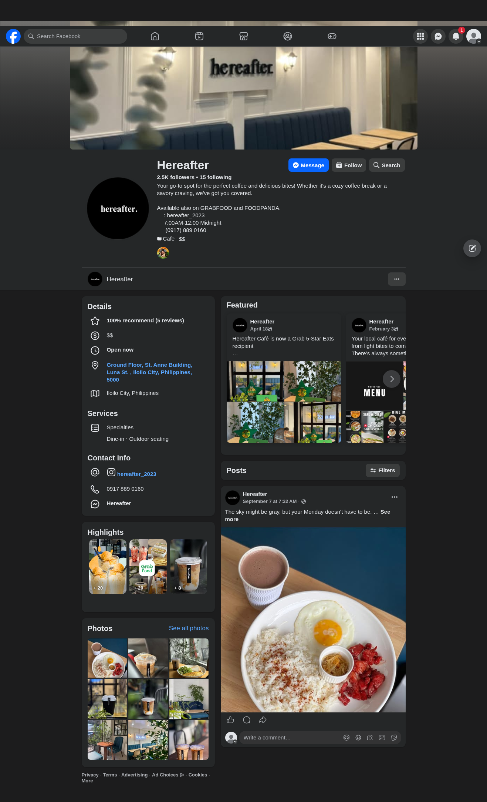
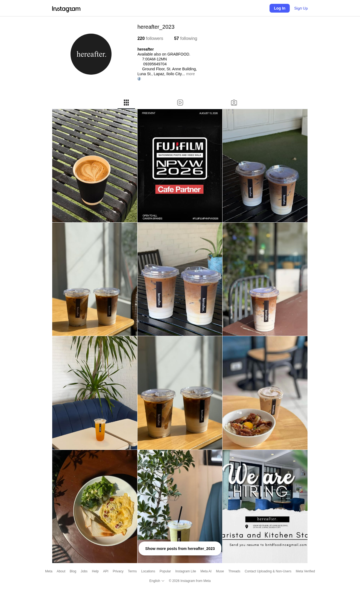

Business: Hereafter Cafe, Lapaz, Iloilo City

Socials:

	- https://www.facebook.com/hereafteriloilocity
    
	- https://www.instagram.com/hereafter_2023
    

Short Explanation Questions:

1. Why did you choose this business?

   They are a local cafe, with a simple and minimal yet interesting aesthetic.
   The decor and atmosphere gave us good inspiration for what the theming of the website.

2. Who is the target audience of the website?

   This website is aimed towards the young and on-the-go students and professionals, who
   yearn for a short retreat from the bustle and hustle of city life.

3. What design choices did you make?

   We kept the designs minimal, with an intentionally chosen and consistent theming all
   throughout the website.
  
4. What problems does your website solve for the business?

   The website can provide a showcase and marketing for visitors and potential customers.
   By intentionally leaving the design more minimal, we hope to invite our customers in
   to experience the vibe for themselves.
   
5. What part of the website are you most proud of?

   The website is aesthetic and consistent with its design and theming, and the code is
   intentionally readable, and only has a minimal build step for templates of shared code
   across some pages.

6. What part did you find most difficult?

   Getting the tooling for the website proved challenging, as I was sunk into multiple
   rabbit holes over multiple days of lost sleep.
